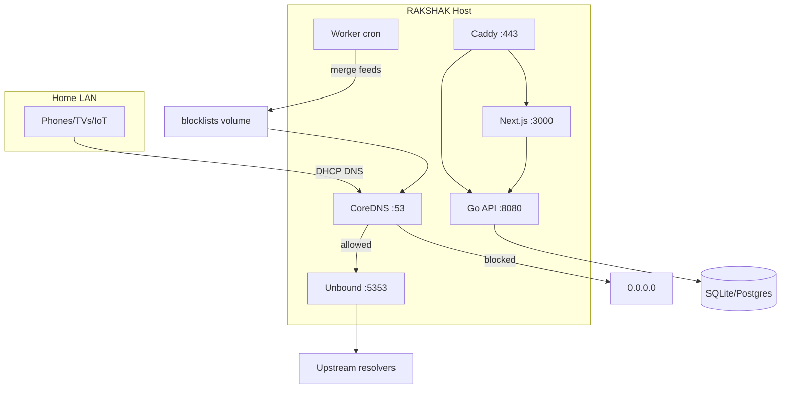

# RAKSHAK System Architecture

## 1. Architecture overview

RAKSHAK is a **split data/control plane** DNS security appliance:

| Plane | Components | Responsibility |
|-------|------------|----------------|
| Data | CoreDNS, Unbound | Answer DNS for entire LAN; sinkhole bad domains |
| Control | Go API, Worker | Policies, blocklists, devices, audit |
| Presentation | Next.js, Caddy | Admin UI, TLS termination |
| Persistence | SQLite/Postgres | Config, logs, inventory |



## 2. Component breakdown

| Component | Tech | Role |
|-----------|------|------|
| `rakshak-coredns` | CoreDNS 1.11 | Sinkhole via `hosts` plugin; cache; forward |
| `rakshak-unbound` | Unbound | Recursive DNS + DNSSEC validation |
| `rakshak-api` | Go 1.22, Gin, GORM | REST control plane |
| `rakshak-worker` | Go cron | Blocklist updates, ARP discovery, retention |
| `rakshak-web` | Next.js 14 | Mobile-first dashboard |
| `rakshak-caddy` | Caddy 2 | Reverse proxy, local HTTPS |
| `prometheus/grafana` | Optional profile | Metrics |

## 3. Tech stack & languages

| Layer | Choice | Rationale |
|-------|--------|-----------|
| DNS engine | CoreDNS | Plugin ecosystem, reload, metrics |
| Resolver | Unbound | DNSSEC, privacy, battle-tested |
| Backend | **Go** | Single binary, concurrency, ops-friendly |
| Frontend | **Next.js/React/TS** | SSR, PWA-ready dashboard |
| DB | SQLite default; Postgres optional | Zero-ops home lab vs scale |
| Proxy | Caddy | Automatic HTTPS (internal CA) |
| Firewall | nftables | Force-DNS, block DoT bypass |

Rust was considered for the DNS path; CoreDNS (Go) + Go control plane avoids rewriting DNS protocol handling.

## 4. DNS filtering architecture

1. Client sends query to `RAKSHAK_LAN_IP:53`
2. CoreDNS `hosts` matches `blocked.hosts` → returns `0.0.0.0` / `::`
3. `local.hosts` allowlist wins via ordering + admin overrides
4. Miss → `cache` → `forward` → Unbound → upstream (1.1.1.1, 8.8.8.8)
5. Worker rebuilds `blocked.hosts` from OSS feeds + policy categories

## 5. Traffic filtering architecture

Primary enforcement: **DNS sinkhole** (covers all devices including IoT).

Optional L3/L4 (host with `CAP_NET_ADMIN`):

- `scripts/firewall/nftables-rakshak.nft` — drop LAN→:53 except RAKSHAK IP
- Drop TCP/853 (DoT bypass)
- Future: SNI filtering proxy (not in v1)

## 6. Malware domain blocking pipeline

```
OSS feeds (URLhaus, HaGeZi, Phishing Army, …)
    → HTTP fetch (worker/API merger)
    → normalize domain lines
    → dedupe hash map
    → subtract allowlist
    → write blocked.hosts
    → CoreDNS hosts plugin reload (5m or restart)
```

Categories map to policy toggles (`block_malware`, `block_phishing`, …).

## 7. Admin dashboard architecture

- Next.js App Router, client-side JWT in `localStorage`
- Rewrites `/api/*` → Go API (Caddy or Next rewrites)
- Pages: login, dashboard, devices, logs, blocklists
- SWR-ready for polling (v1 uses `useEffect`)

## 8. Device management

- Discovery: parse `/proc/net/arp` on Linux host (worker)
- Enrichment: reverse DNS hostname
- Groups + policies (DB schema) — per-device policy in v1.1
- Block device: set `blocked` + custom firewall rule (future)

## 9. Auto-update system

| What | Mechanism |
|------|-----------|
| Blocklists | Cron `0 4 * * *` in worker |
| Containers | `docker compose pull && up -d` (manual/Watchtower opt-in) |
| Feeds | Curated URLs in `blocklist_feeds` table |

## 10. Logging & analytics

| Log type | Storage | Retention |
|----------|---------|-----------|
| DNS queries | `dns_query_logs` | 7 days default |
| Admin audit | `audit_logs` | 90 days |
| Container | Docker json-file | host rotation |

Prometheus scrapes CoreDNS `:9153`. Grafana dashboards optional (`--profile monitoring`).

## 11. Security hardening

- JWT HS256, 24h TTL, bcrypt passwords
- Caddy security headers
- Internal query-log endpoint should be firewalled to Docker network
- Secrets only in `.env`, never committed
- Unbound: hide version, QNAME minimisation, DNSSEC
- Fail-**closed** default (no DNS if stack down)

## 12. Router integration

Set DHCP DNS to RAKSHAK host IP. See `scripts/configure-router.sh`.

For routers that push ISP DNS: disable "DNS from ISP" / use manual DNS.

## 13–15. Docker, reverse proxy, HTTPS

See root `docker-compose.yml`, `deploy/caddy/Caddyfile`.

Caddy `local_certs` issues internal CA — import once on admin devices.

## 16. Local network discovery

ARP table scan + DNS query client IP correlation.

## 17. Safe defaults

`config/defaults.yaml` — all threat categories enabled; fail-closed; 7-day logs.

## 18. Performance optimization

- CoreDNS cache 300s with prefetch
- Unbound prefetch + aggressive NSEC
- Blocklist sorted hosts file (binary search in plugin)
- SQLite WAL mode

## 19. RAM/CPU requirements

See README table. Rule of thumb: **2 GB RAM** for 100k+ block domains.

## 20. Threat model

See [THREAT_MODEL.md](./THREAT_MODEL.md).

## 21. Scalability

| Scale | Approach |
|-------|----------|
| Home | Single node, SQLite |
| Power user | Postgres, dedicated NIC for DNS |
| Multi-site | Future: Anycast + replica read-only DNS |

## 22. Privacy

- No third-party SaaS
- Query logs stay local
- Upstream sees forwarded queries (use Unbound root or DoT upstream in hardened profile)

## 23. Mobile-friendly dashboard

CSS grid + responsive tables; viewport meta; touch-friendly buttons.

## 24. Fail-safe behavior

| Mode | Behavior |
|------|----------|
| **closed** (default) | DNS stops if CoreDNS down — users notice, no silent bypass |
| **open** (opt-in watchdog) | `scripts/failopen-watchdog.sh` documents ISP DNS fallback |

Docker `restart: unless-stopped` on all services.

## Database schema

See [SCHEMA.md](./SCHEMA.md).

## API routes

| Method | Path | Auth |
|--------|------|------|
| GET | `/health` | No |
| POST | `/api/v1/auth/login` | No |
| GET | `/api/v1/dashboard/stats` | JWT |
| GET | `/api/v1/devices` | JWT |
| PATCH | `/api/v1/devices/:id` | JWT |
| POST | `/api/v1/devices/discover` | JWT |
| GET | `/api/v1/policies` | JWT |
| PATCH | `/api/v1/policies/:id` | JWT |
| GET | `/api/v1/blocklists/feeds` | JWT |
| POST | `/api/v1/blocklists/update` | JWT |
| GET | `/api/v1/logs/queries` | JWT |
| POST | `/api/v1/internal/query-log` | Internal |
